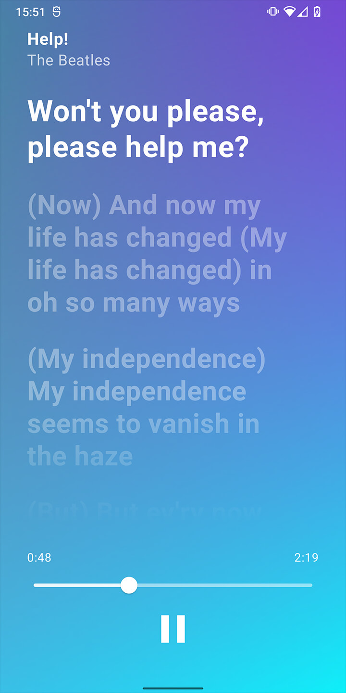
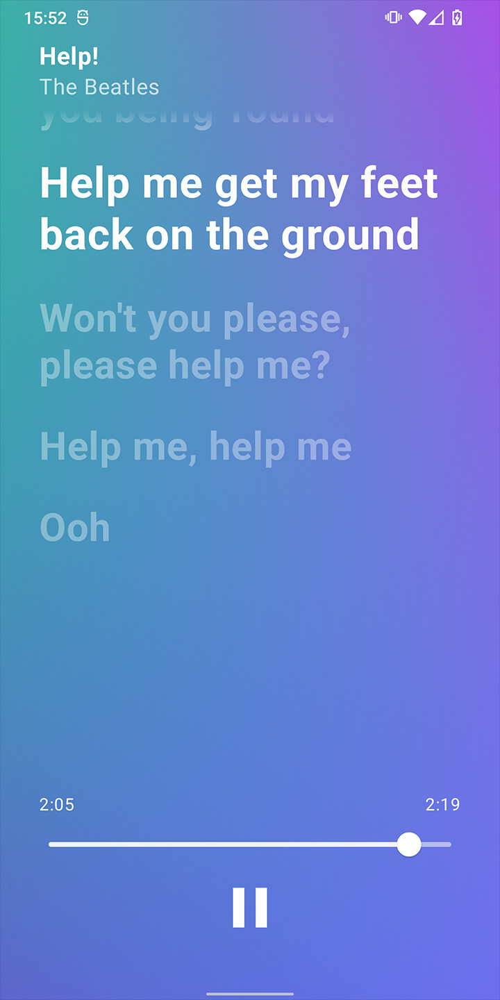

# AMLV

Apple Music (for Android) Lyrics View in Jetpack Compose.

**Screenshots**

**Video**

Check this [tweet](https://twitter.com/EnDeepFour/status/1612742331773423617)

### Details

- Parse and display `.lrc` lyrics
- Apple Music like animations
- The fluid gradient background is based on [KlassenKonstantin/FluidBg.kt](https://gist.github.com/KlassenKonstantin/d5f6ed1d74b3ddbdca699d66c6b9a3b2)
- Fading edges
- Able to play, pause and seek
